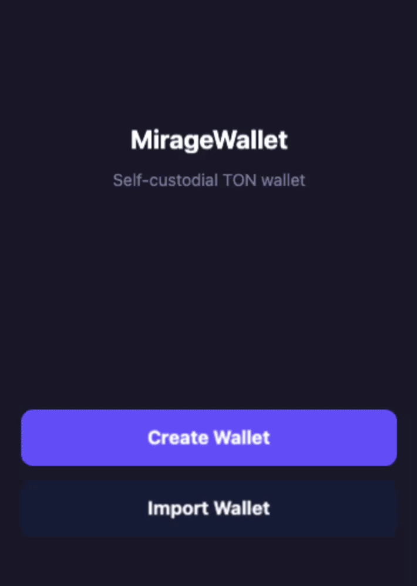
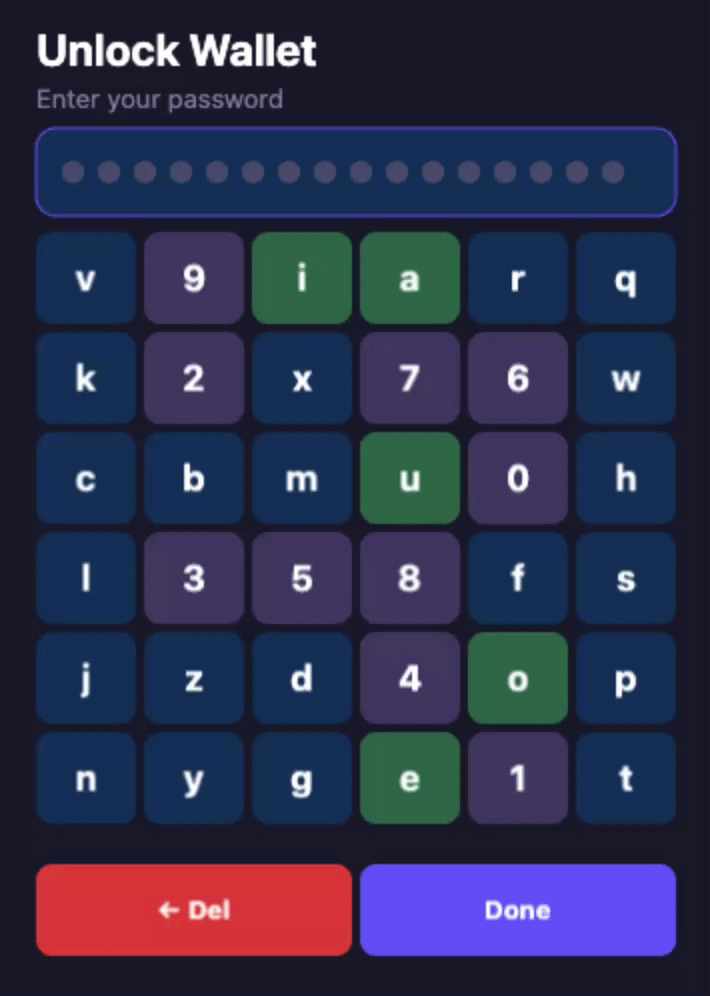
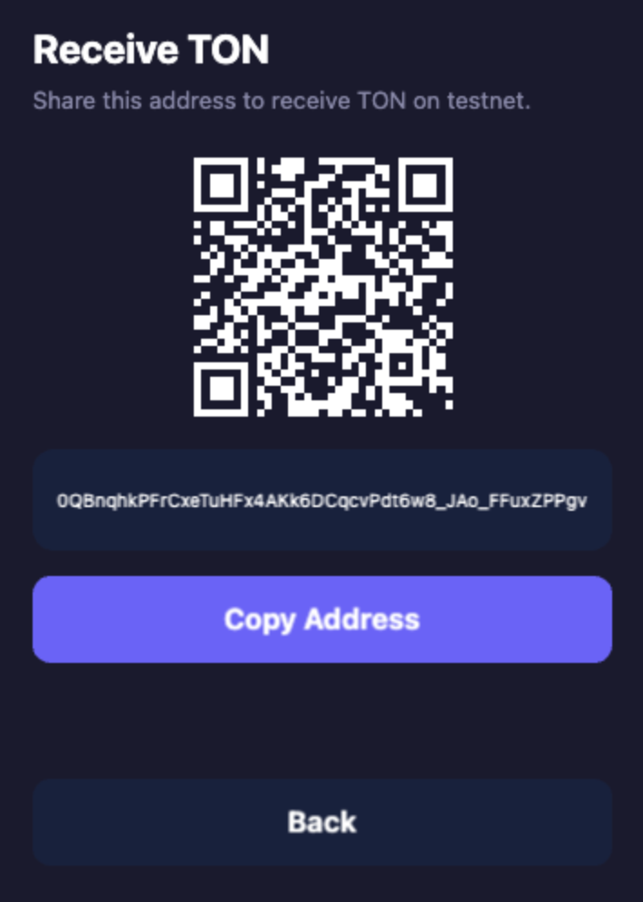

# About MirageWallet





Это небольшой пример экспериментального кошелька для TON TEST NET, в котором сделан упор на защиту от расширений, анализа DOM, screen/key логгеров

Так как это всего лишь тестовое задание, я позволил себе проявить некоторую креативность. Полагаю, что подавляющее большинство решений будут работать на vue/react и выглядеть довольно типично. Это может сделать каждый, это банально скучно

В MirageWallet я решил попробовать отказаться от работы с DOM, чтобы из тела страницы нельзя было просто спарсить пароли, кодовые фразы и так далее. Для отрисовки графического интерфейса я выбрал canvas + PixiJS (пикси взял для простоты, там уже есть готовые сущности кнопочек и так далее)

Chrome extension (для дополнительной защиты), а не обычная веб страница. Дело в том, что popup расширения работает в изолированной среде, к которой другие расширения не имеют доступа. Обычная страница такой защиты не имеет. Но все еще есть опция что-то автоматизировать через инспектор (но DOM при этом не используется)

Для ввода паролей сделана виртуальная клавиатура, которая рендерится прямо в canvas. Раскладка рандомизируется, нет keyboard events, нет анимации нажатия (чтобы нельзя было определить нажатую клавишу по визуальному отклику). Поле ввода всегда показывает фиксированное количество точек. При наведении курсора на конкретную точку можно увидеть символ

Seed фраза при создании кошелька отображается в перемешанном порядке, скрыта за плашками одинаковой длины, то есть увидеть слово можно только при наведении. При импорте пословный ввод через ту же виртуальную клавиатуру с подсказками

Баланс на главном экране тоже скрыт до наведения курсора. Идея в том, что скриншот или запись экрана не должны давать полезной информации

Перед отправкой работает address guard: новый адрес (не из whitelist), отправка самому себе, подмена в буфере обмена (адрес изменился после paste), и address poisoning (адрес похож на известный, но отличается в середине)

Мнемоника шифруется с помощью AES-25. Правильность пароля проверяется неявно: если GCM authentication tag не сошелся - пароль неверный

Навигация построена на xstate с 14 состояниями. Это универсальная машина состояний, которая подходит для решения очень разных задач. Невозможные переходы просто игнорируются, нельзя попасть на экран подтверждения не пройдя валидацию

Все строки, цвета, размеры, таймауты вынесены в единый config.ts. Тесты написаны на встроенном в bun test runner — 82 теста покрывают TON-логику, шифрование vault и все переходы state machine

Все это построено с использованием Bun и Claude Code CLI. Bun я беру потому, что с ним просто быстрее стартуешь разработку фронта/бэка на TypeScript + Claude отлично его узнает, а cli буквально на нем сделан. Короче, они друг с другом хорошо дружат, а я трачу меньше времени на бесконечные конфиги, шаг сборки ts и так далее

### Осознанные компромиссы

UI в canvas реализуется гораздо сложнее, местами может работать медленее, а бандл занимает больше места (можно и без pixi, но для простоты и скорости разработки — можно). Это помогает защититься от простого автоматизированного анализа DOM

Виртуальная клавиатура неудобна с точки зрения использования и лишена части анимаций, обозначающих нажатие, дающих визуальный отклик. Это помогает защититься от key/screen логгеров

Последовательные API-запросы с задержкой к TonCenter. Это проще и быстрее в реализации, но совершенно неподходит для боевого кошелька

Общее отсутствие симпатичного дизайна. Я решил сделать упор на эксперимент с безопасностью, но не на верстку и дизайн

Страшно неудобный последовательный ввод сид фразы при импорте кошелька. Опять же, это было сделано ради интереса и попытки защититься от скрин/кей логгеров

## Quick Start

```bash
bun install
bun run build
bun test
```

Load in Chrome: `chrome://extensions` > Developer mode > Load unpacked > select `dist/`.

## Project Structure

```
manifest.json                Chrome extension manifest (MV3)
popup.html                   Extension popup entry point
src/
  config.ts                  All constants, colors, strings, sizes
  state.ts                   xstate v5 state machine (14 states)
  popup.ts                   Entry point: PixiJS app + screen manager
  ui.ts                      UI primitives (button, text, panel, input, spinner)
  ton.ts                     TON SDK wrapper (wallet, balance, tx, send, address guard)
  vault.ts                   Encrypted storage (AES-256-GCM via Web Crypto API)
  wallet-manager.ts          Wallet lifecycle (create/import/unlock/lock/send)
  virtual-keyboard.ts        Canvas-rendered randomized keyboard for passwords
  seed-input.ts              Word-by-word seed phrase input with BIP39 autocomplete
  screens/
    onboarding.ts            Create / Import choice
    create.ts                Seed phrase display (hover-to-reveal, shuffled)
    import.ts                Seed phrase input via virtual keyboard
    password.ts              Set password / Unlock (virtual keyboard)
    dashboard.ts             Balance, transactions, search, polling
    receive.ts               Address + QR code + copy
    send.ts                  Send form, warning, confirm, pending, success, error
    settings.ts              Reset wallet
tests/
  ton.test.ts                39 tests: wallet, address, search, guard, validation
  vault.test.ts              13 tests: encrypt/decrypt, whitelist
  state.test.ts              30 tests: all state transitions
```
